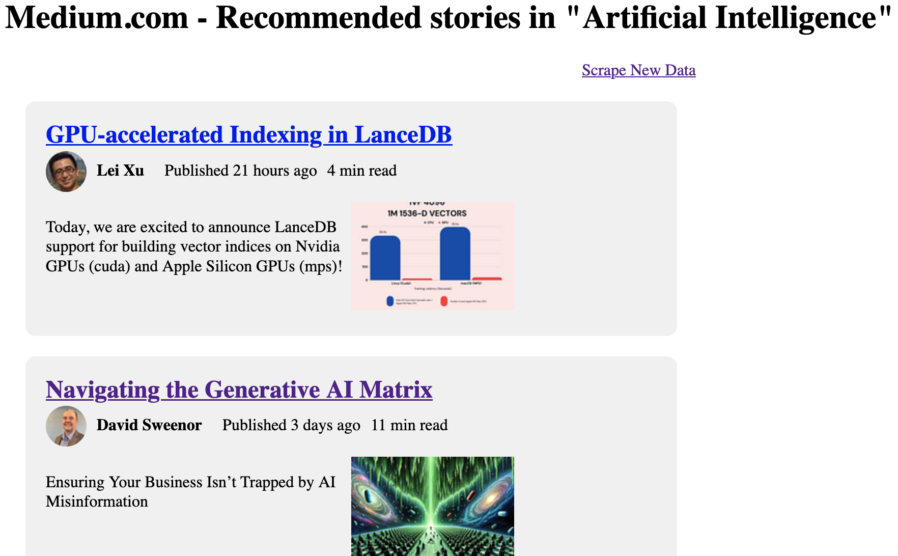

# Web Scraping - Medium AI News

This project aims to create a web app that showcases the most recently published recommended articles related to [AI news on Medium.com](https://medium.com/tag/artificial-intelligence).

**Roadmap**
1. Web scraping *in live* data from [https://medium.com/tag/artificial-intelligence](https://medium.com/tag/artificial-intelligence) webpage with BeautifulSoup
2. Store and query data with MongoDB
3. Showcase data with Flask

**Tools**
- Python
- BeautifulSoup
- MongoDB via pymongo
- Flask

**How to use it**
To display the webpage: 
1. If it is not already done, install [MongoDB Community Edition](https://www.mongodb.com/docs/manual/administration/install-community/)

2. Run the <code>run.py</code> Python script in the Terminal
<u>Command:</u> <code>python run.py</code>

3. Load the URL <code>http://127.0.0.1:5000</code> in your favorite web browser

4. Run web scraping by clicking on the <code>Scrape New Data</code> hyperlink